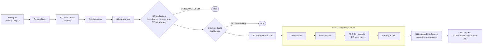

# Dhwani

Dhwani is a blind analyser for off-air HF/VHF/UHF recordings that arrive
as `.wav` or `.iq` with missing or inconsistent metadata. From raw
samples it detects signals, estimates their parameters (sample-rate
candidates, symbol rate, bandwidth, SNR), identifies and demodulates the
modulation (PSK, QAM, FSK and more), removes the scrambler, identifies
and undoes the interleaver (block, diagonal/helical, convolutional;
pseudo-random by period), identifies and decodes the FEC (convolutional
with Viterbi, Reed-Solomon, LDPC, RS+convolutional concatenated), splits
header from payload by bit-stream correlation and CRC, and says what the
payload is. Every value carries a confidence and the method that produced
it; what cannot be determined is reported as unknown. It ships as a CLI,
a PyQt6 GUI and a static web viewer.



S7-S10 are a search, not a forward pass: candidate bit streams are
pre-scored by GF(2) rank deficiency, the beam survivors go through
descrambling, interleaver and FEC identification and framing, and a
CRC-validated chain exits early.

## What it recovers, verified end to end

`python examples/demo.py` generates a QPSK signal with a CCSDS
convolutional code (K=7, generators 171/133 octal), an 8x16 block
interleaver, PN9 whitening, 96-bit frames with a sync word and
CRC-16/CCITT, plus AWGN, carrier and phase offset, writes it to a raw
`.iq` file, analyses it blind and prints PASS/FAIL for every element of
that chain (exit status 1 on any miss).

The same chain ships as `web/demo/demo_chain.wav` (stereo 16-bit I/Q, 1 MS/s
in the header, synthetic): the "Load demo" button in `dhwani-gui` runs the full S0-S12 chain on it,
`web/analyze.html` has a matching button for the browser S0-S5 preview, and
`web/viewer.html?demo=1` shows its analysis.

## Installation

Requires Python 3.11+ (3.12 recommended).

```bash
git clone https://github.com/BhoomiAgrawal12/SignalProcessing.git
cd SignalProcessing
python -m venv .venv            # or: uv venv --python 3.12 .venv
source .venv/bin/activate
pip install -e ".[all]"         # or: uv pip install -e ".[all]"
```

Dependency groups (install only what you need):

| extra    | packages                     | needed for                       |
|----------|------------------------------|----------------------------------|
| (core)   | numpy, scipy                 | everything in S0-S10             |
| `ml`     | torch, huggingface_hub       | CVNet-RF modulation engine       |
| `gui`    | PyQt6, pyqtgraph             | desktop analyst GUI              |
| `io`     | soundfile                    | 24-bit PCM WAVs                  |
| `report` | reportlab                    | PDF export                       |
| `fec`    | reedsolo                     | Reed-Solomon decode              |
| `dev`    | pytest                       | test suite                       |

### CVNet-RF model

The ML modulation engine uses the verified Hugging Face model
`sohelimi/cvnet-rf` (trained on RadioML 2018.01A, 24 classes, input
(2, 1024); its model card reports 54.4% validation accuracy for the
`real` variant averaged over -20..+30 dB SNR, which is why it is fused as
an advisory engine, not an authority). Checkpoints download automatically on first use via
`huggingface_hub`, pinned to a repo revision and SHA-256 (a mismatch
raises), and are loaded with `weights_only=True` so a checkpoint cannot
run code. Manual download (same pin):

```bash
python -c "from huggingface_hub import hf_hub_download; \
  hf_hub_download('sohelimi/cvnet-rf', 'real_best.pt', \
  revision='df32f6cd9bb033835465928307610bba1c376708', \
  local_dir='ml/cvnet_rf/checkpoints')"
```

Device selection is automatic (MPS on Apple silicon, CUDA if present,
CPU otherwise); force it with `modulation.device` in the config.
Run with `--no-ml` to skip the ML engine entirely; the classical
cumulant engine covers the supported classes on its own.

## CLI

```bash
dhwani detect  recording.iq --sample-rate 2000000
dhwani classify recording.iq --sample-rate 2000000
dhwani analyze recording.iq --sample-rate 2000000 -o out/
dhwani analyze recording.wav                     # rate from WAV header
dhwani analyze recording.iq --modulation BPSK    # analyst override
dhwani report out/analysis.json -o out2/         # re-render exports
dhwani synth test.iq  --modulation QPSK --fec conv \
    --interleaver block --scrambler pn9 --snr 20 # raw complex64 IQ
dhwani synth test.wav --sample-rate 1000000 \
    --modulation QPSK --snr 25                   # stereo WAV (I/Q, f32)
dhwani synth test.sigmf --sample-rate 1000000 \
    --centre-frequency 433920000 --modulation QPSK # SigMF pair + truth
dhwani synth ldpc.iq --fec ldpc --snr 25         # LDPC-coded signal
dhwani synth cat.iq --fec concat --frames 80      # RS outer + conv inner
dhwani signatures                                # signature library
```

For a headerless raw `.iq` file the sample rate is genuinely not
recoverable from the data. It is taken from `--sample-rate`, a SigMF
sidecar, or a file name written by the recording software (GQRX
`gqrx_..._<freq>_<rate>_fc.raw`, or tokens such as `2.4Msps` / `437.5MHz`,
labelled source "filename"); otherwise it stays unknown, S4 lists PROBABLE
candidates, and all frequencies are reported per recorded sample.

A mono (single-channel) `.wav` is a real signal: it is converted to
complex baseband (mixed by -fs/4, half-band filtered, decimated by 2), so
the reported sample rate is fs/2 and the centre frequency is shifted by
fs/4. Analysis runs on one 2^22-sample window: a longer file is scanned
window by window (up to 16, about 67M samples) and the window with the
strongest signal is analysed, or `--start-sample N` picks it; the span is
recorded in `recording.analysed_start` / `analysed_samples`.

## GUI

```bash
dhwani-gui
```

Eight pages: Load and Inspect, Spectrum and Waterfall, Parameters,
Modulation, Demodulation (constellation + eye diagram), Bit Layer (rank
profile + hypothesis table), Frames and Payload (entropy field map + hex
view), Report and Export. Analysis runs on a worker thread; any decision
can be overridden, which re-runs the pipeline with the override pinned
(only S2 detection is served from the cache).

## Web report viewer

`web/` is a static site (deployable on Vercel) with a client-side viewer
for exported `analysis.json` reports: PSD, waterfall, constellation, eye
diagram, rank profile, entropy field map, verdicts and payload hex, all
rendered in the browser with no upload.

## Tests and results

```bash
pytest                                # everything (about 2.5 minutes)
python scripts/benchmark.py --big     # -> results/benchmark.json
python scripts/validate_matrix.py     # -> results/validation_report.json
python scripts/validate_bitlayer.py   # -> results/bitlayer_report.json
python scripts/validate_offair.py     # -> results/offair_report.json
python scripts/render_readme.py       # re-render the block below
python web/make-test-fixtures.py && node web/test-node.js
```

The numbers below are rendered from `results/*.json` by
`scripts/render_readme.py`; each file records the machine, versions,
commit and command that produced it. Do not edit this block by hand.

<!-- results:begin -->
### Speed (synthetic inputs)

| operation | measured | design target |
|---|---:|---|
| wideband detection, 2M samples | 0.13 s | < 2 s |
| symbol-rate estimation (cyclic periodogram) | 0.04 s | 1-5 s |
| demodulation of 106100 symbols | 0.67 s | < 1 s per 100k |
| GF(2) rank scan L=2..512, 50k bits | 0.68 s | 5-30 s |
| FEC identification (conv sweep + decode) | 0.73 s | 10-60 s |
| end-to-end, one clean signal (full stack) | 4.97 s | < 90 s |
| 1 GB IQ file: load + first waterfall | 0.14 s | < 3 s |

_Source: `results/benchmark.json` (synthetic (dhwani.synth.WaveformFactory)), commit `667e906`, Apple M1 Pro, Python 3.14.8, 2026-10-08T06:32:12Z._

### Modulation ID and demodulation (synthetic)

57 PASS, 10 DEGRADED, 6 FAIL of 73 cases.


| modulation | cases | blind top-1 | 95% CI | blind top-2 |
|---|---:|---:|---:|---:|
| BPSK | 2 | 50% | - | 100% |
| BPSK (CFO 0) | 1 | 100% | - | 100% |
| QPSK | 2 | 100% | - | 100% |
| QPSK (CFO 0) | 1 | 100% | - | 100% |
| OQPSK | 2 | 100% | - | 100% |
| OQPSK (CFO 0) | 1 | 100% | - | 100% |
| 8PSK | 2 | 100% | - | 100% |
| 8PSK (CFO 0) | 1 | 100% | - | 100% |
| 16PSK | 2 | 100% | - | 100% |
| 16PSK (CFO 0) | 1 | 100% | - | 100% |
| 32PSK | 2 | 100% | - | 100% |
| 32PSK (CFO 0) | 1 | 100% | - | 100% |
| OOK | 2 | 100% | - | 100% |
| OOK (CFO 0) | 1 | 100% | - | 100% |
| 4ASK | 2 | 100% | - | 100% |
| 4ASK (CFO 0) | 1 | 100% | - | 100% |
| 8ASK | 2 | 100% | - | 100% |
| 8ASK (CFO 0) | 1 | 100% | - | 100% |
| 16QAM | 2 | 100% | - | 100% |
| 16QAM (CFO 0) | 1 | 100% | - | 100% |
| 32QAM | 2 | 100% | - | 100% |
| 32QAM (CFO 0) | 1 | 100% | - | 100% |
| 64QAM | 2 | 100% | - | 100% |
| 64QAM (CFO 0) | 1 | 100% | - | 100% |
| 128QAM | 2 | 100% | - | 100% |
| 128QAM (CFO 0) | 1 | 100% | - | 100% |
| 256QAM | 2 | 50% | - | 100% |
| 256QAM (CFO 0) | 1 | 0% | - | 0% |
| 16APSK | 2 | 100% | - | 100% |
| 16APSK (CFO 0) | 1 | 100% | - | 100% |
| 32APSK | 2 | 100% | - | 100% |
| 32APSK (CFO 0) | 1 | 100% | - | 100% |
| 64APSK | 2 | 100% | - | 100% |
| 64APSK (CFO 0) | 1 | 100% | - | 100% |
| 128APSK | 2 | 100% | - | 100% |
| 128APSK (CFO 0) | 1 | 100% | - | 100% |
| 2FSK | 2 | 50% | - | 50% |
| 2FSK (CFO 0) | 1 | 100% | - | 100% |
| 2FSK (4 sps) | 1 | 100% | - | 100% |
| 4FSK | 2 | 100% | - | 100% |
| 4FSK (CFO 0) | 1 | 100% | - | 100% |
| 4FSK (4 sps) | 1 | 100% | - | 100% |
| GMSK | 2 | 50% | - | 50% |
| GMSK (CFO 0) | 1 | 100% | - | 100% |
| GMSK (4 sps) | 1 | 100% | - | 100% |
| OFDM | 2 | 100% | - | 100% |
| FM | 1 | 0% | - | 0% |
| AM-DSB-WC | 1 | 0% | - | 0% |
| AM-DSB-SC | 1 | 0% | - | 0% |
| AM-SSB-WC | 1 | 0% | - | 0% |
| AM-SSB-SC | 1 | 0% | - | 0% |

_Source: `results/validation_report.json` (synthetic (dhwani.synth.WaveformFactory)), commit `b5c0379`, Apple M1 Pro, Python 3.14.8, 2026-10-08T01:50:29Z._

### Interleaver and FEC identification (synthetic)




| interleaver | cases | interleaver ID | FEC ID | CRC pass |
|---|---:|---:|---:|---:|
| none | 5 | 100% | 100% | 100% |
| block | 5 | 20% | 40% | 20% |
| helical | 5 | 20% | 40% | 20% |
| convolutional | 5 | 20% | 40% | 20% |
| pseudo_random | 5 | 20% | 20% | 0% |

| FEC | cases | interleaver ID | FEC ID | CRC pass |
|---|---:|---:|---:|---:|
| none | 5 | 20% | 100% | 20% |
| convolutional | 5 | 100% | 80% | 80% |
| reed_solomon | 5 | 20% | 20% | 20% |
| ldpc | 5 | 20% | 20% | 20% |
| concatenated | 5 | 20% | 20% | 20% |

_Source: `results/bitlayer_report.json` (synthetic (dhwani.synth.WaveformFactory)), commit `b5c0379`, Apple M1 Pro, Python 3.14.8, 2026-10-08T02:02:23Z._

### Headerless sample-rate candidates (synthetic)

True sample rate among the PROBABLE candidates (with a correct symbol rate) in 10 of 10 headerless files; symbol rate right in 10; 4.1 candidates on average; sample rate applied: never.

_Source: `results/samplerate_report.json` (synthetic (dhwani.synth.WaveformFactory)), commit `30ac201`, Apple M1 Pro, Python 3.14.8, 2026-10-08T05:39:49Z._

### Off-air recordings

_No off-air results yet: every number above is synthetic. Add licensed recordings and run `python scripts/validate_offair.py`._
<!-- results:end -->

## Supported modulations (S6 demodulation)

Every family runs through a dispatched receiver with family-specific
synchronisation and a mandatory quality gate
(`demodulation_status = GOOD | DEGRADED | FAILED`); a FAILED demodulation
stops the pipeline instead of feeding the bit layer unreliable bits.

| family | modulations | carrier strategy |
|--------|-------------|------------------|
| PSK    | BPSK, QPSK, 8PSK, 16PSK, 32PSK | DD-PLL (<=8), slip-free V&V feedforward (>=16) |
| OQPSK  | OQPSK | x^4 carrier first, x^2 line-pair rate, dual stagger trial |
| ASK    | OOK, 4ASK, 8ASK | 2nd-moment axis alignment + slow PLL |
| QAM    | 16/32/64/128/256-QAM | symbol-domain CFO + phase grid + slow polish (no loops on dense QAM) |
| APSK   | 16/32/64/128-APSK | ring-gated V&V + symmetry-aware coset snap |
| CPM    | 2FSK, 4FSK, GMSK | discriminator; GMSK rate/carrier from x^2 squaring lines |
| OFDM   | detected + parameterised (N_FFT, CP), multi-evidence, not demodulated |
| analog | AM-DSB-WC/SC, AM-SSB-WC/SC, FM | envelope / coherent / discriminator + audio LPF; audio out, no bit layer |

`scripts/validate_matrix.py` measures every modulation against ground
truth (blind classification, known-modulation BER, full blind chain with
frames/CRC/payload trust) with a PASS/DEGRADED/FAIL verdict per case;
see the results block above.

## Evidence gates and trust

The pipeline is evidence-driven: S5 only names a constellation that
locks in a real receiver trial (EVM against the candidate's own gate,
point occupancy, residual-bias structure) and withholds the claim as
UNKNOWN when nothing locks; S6 gates on EVM/locks/rotational
concentration; S10 accepts a frame only with a CRC pass or a sync word
plus cross-frame stability (rejections are reported with their evidence);
S11 grades its input VALIDATED / PROBABLE / SPECULATIVE from the CRC, FEC
and demodulation provenance and caps every finding accordingly.

## S11 payload intelligence

After payload recovery, S11 answers "what do those bytes mean" with
evidence, confidence bands (VALIDATED / LIKELY / POSSIBLE / WEAK) and
explicit limitations: byte/bit forensics, conservative text decoding,
Base64/hex/URL wrapper discovery, cross-frame field inference (constant
headers, counters, length fields), compression detection with bounded
real decompression, conservative encryption assessment (high entropy is
never alone called encryption), validated protocol fingerprints (JSON,
HTTP, IPv4 with checksum), and message reconstruction. Provenance is
preserved: a payload recovered without CRC validation has its findings
capped. Reporting (JSON/CSV/PDF/SigMF/GRC) is stage S12 and includes the
S11 section; the web viewer renders it with an animated stage-by-stage
pipeline flow recorded by the engine.

## Limitations

The full, current list is in [docs/LIMITATIONS.md](docs/LIMITATIONS.md).
The ones most likely to matter: only the first 2^22 samples are
analysed; a headerless IQ file's sample rate stays unknown (S4 offers
PROBABLE candidates only); dense PSK can false-lock on a carrier alias
(then reported DEGRADED, not GOOD); pseudo-random interleaver
permutations are not recovered; and every number above is synthetic
until off-air recordings are scored.

## Technology decisions (verified, not assumed)

- **CVNet-RF**: verified on Hugging Face, architecture and checkpoint
  format read from the repository files, integrated with its own
  preprocessing. Used as an advisory engine because of its honest ~54%
  all-SNR accuracy.
- **GNU Radio**: not installed on the dev machine and deliberately kept
  optional; the core is pure NumPy/SciPy with a clean seam
  (`channelize`, `demodulate`) where a GR-backed implementation can be
  slotted in, plus `.grc` export.
- **DSpectrum / DSpectrumGUI** (tresacton, the tool "D-spectrum" refers
  to): verified to exist but deprecated, Ruby-based and aimed at simple
  OOK/PWM ISM remotes; unsuitable here, so the reverse-engineering
  functionality is implemented natively (bit layer engine).
- **TorchSig**: not used; our synthetic factory generates the labels
  TorchSig cannot (FEC, interleaver, scrambler, frame ground truth).
- **liquid-dsp / AFF3CT / libfec**: not required to meet the performance
  targets (see benchmarks); candidates for a future fast path behind the
  existing interfaces.
- **reedsolo** (RS decode), **sigmf**, **soundfile**, **reportlab**:
  verified and used.

Deep dives: [architecture](docs/ARCHITECTURE.md),
[algorithms](docs/ALGORITHMS.md), [development](docs/DEVELOPMENT.md),
[threat model](docs/THREAT_MODEL.md),
[how the numbers are made](docs/BENCHMARK_METHOD.md),
[limitations](docs/LIMITATIONS.md).
